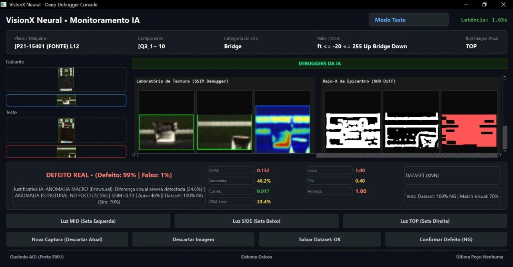
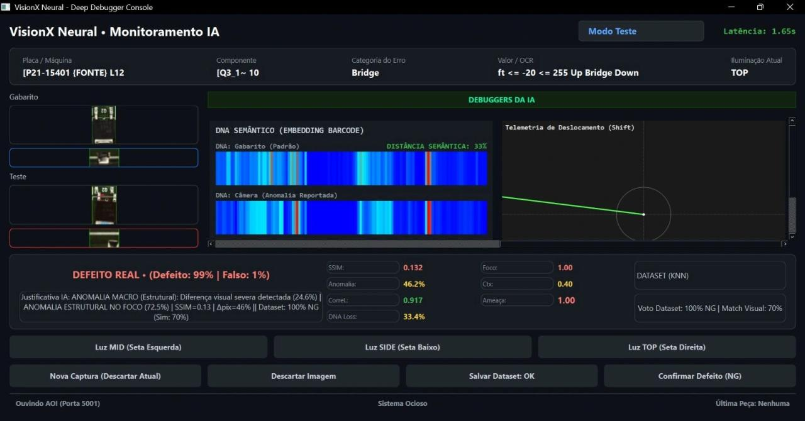

# VisionX Neural


**VisionX Neural** é um sistema experimental de visão computacional e inteligência artificial para apoio à inspeção visual de componentes eletrônicos em ambiente industrial.

O objetivo do projeto é atuar como um módulo inteligente de análise visual, comparando imagens de referência com imagens capturadas durante o processo, identificando possíveis anomalias, registrando evidências e apoiando a tomada de decisão entre **OK** e **NG**.

---

## Visão geral

O sistema foi desenvolvido em **Python** com interface em **PyQt6**, combinando técnicas de visão computacional clássica, análise de similaridade visual, extração de características e mecanismos de aprendizado incremental.

A aplicação foi pensada para cenários onde uma máquina, câmera ou estação de inspeção precisa de um apoio adicional para analisar regiões críticas da peça, reduzindo a dependência de validações totalmente manuais e criando histórico visual para melhoria contínua.

---

## Demonstração visual

### Deep Debugger — SSIM, anomalia e XOR Diff



### DNA Semântico e telemetria de deslocamento



---

## Principais recursos

- Interface desktop para monitoramento técnico em tempo real.
- Comparação entre imagem de **gabarito** e imagem de **teste**.
- Análise visual com métricas de similaridade e diferença estrutural.
- Painel de depuração para investigação da decisão da IA.
- Classificação assistida entre imagem **OK** e possível defeito **NG**.
- Salvamento de amostras para formação de dataset local.
- Suporte a fluxo de **active learning**, permitindo melhorar a base de exemplos com validação humana.
- Organização modular em camadas de configuração, núcleo, serviços, interface e utilitários.

---

## Técnicas utilizadas

O projeto combina diferentes abordagens para aumentar a confiabilidade da análise visual:

| Técnica | Uso no sistema |
|---|---|
| **OpenCV** | Tratamento de imagem, recortes, comparação visual e operações de visão computacional. |
| **SSIM** | Medição de similaridade estrutural entre referência e imagem analisada. |
| **XOR Diff** | Visualização das regiões que apresentam diferença relevante. |
| **PyTorch** | Base para módulos de rede neural e análise comparativa. |
| **KNN / Dataset local** | Apoio à decisão com base em amostras salvas. |
| **PyQt6** | Construção da interface desktop e painéis de depuração. |
| **mss** | Captura rápida de tela para integração com ambiente de inspeção. |

---

## Arquitetura planejada

O projeto foi organizado em quatro pilares principais:

1. **Extrator Visual**  
   Monitora a tela ou fonte de imagem, captura regiões de interesse e prepara os dados para análise.

2. **Cérebro Comparativo**  
   Compara gabarito e teste usando visão computacional, métricas visuais e modelos de IA.

3. **Display HUD / Painel de Controle**  
   Exibe o diagnóstico, métricas de confiança, visualizações intermediárias e ações disponíveis.

4. **Active Learning**  
   Permite salvar exemplos aprovados ou rejeitados, alimentando um dataset local para melhoria contínua.

---

## Estrutura do projeto

```txt
visionx-neural/
├── public/
│   ├── debug_crop/
│   └── debug_ocr/
├── src/
│   ├── config/
│   ├── core/
│   ├── scripts/
│   ├── services/
│   ├── ui/
│   └── utils/
├── main.py
├── estrutura_projeto.md
└── .gitignore
```

### Descrição das principais pastas

| Pasta / arquivo | Função |
|---|---|
| `main.py` | Ponto de entrada da aplicação. Inicializa a interface principal. |
| `src/config/` | Centralização de configurações, caminhos e constantes. |
| `src/core/` | Núcleo de processamento e regras principais da análise visual. |
| `src/services/` | Serviços auxiliares de captura, processamento ou comunicação. |
| `src/ui/` | Componentes de interface gráfica. |
| `src/utils/` | Funções utilitárias usadas pelo sistema. |
| `public/debug_crop/` | Saídas e recortes usados para depuração visual. |
| `public/debug_ocr/` | Arquivos de apoio e depuração relacionados a OCR. |

---

## Instalação

Clone o repositório:

```bash
git clone https://github.com/carlosdaniel003/visionx-neural.git
cd visionx-neural
```

Crie um ambiente virtual:

```bash
python -m venv .venv
```

Ative o ambiente virtual:

```bash
# Windows
.venv\Scripts\activate

# Linux/macOS
source .venv/bin/activate
```

Instale as dependências principais:

```bash
pip install PyQt6 opencv-python torch torchvision mss numpy pillow scikit-image scikit-learn
```

> Observação: caso o projeto passe a ter um `requirements.txt`, prefira instalar com `pip install -r requirements.txt` para manter as versões padronizadas.

---

## Como executar

Com o ambiente virtual ativo, execute:

```bash
python main.py
```

A aplicação inicia o painel principal do VisionX Neural.

---

## Fluxo básico de uso

1. Carregar ou capturar a imagem de referência da peça.
2. Capturar a imagem de teste.
3. Comparar as regiões críticas entre gabarito e teste.
4. Avaliar métricas como similaridade, anomalia, correlação e perda visual.
5. Exibir o diagnóstico sugerido pela IA.
6. Confirmar a classificação como **OK** ou **NG**.
7. Salvar a amostra no dataset para evolução da base de conhecimento.

---

## Objetivo industrial

O VisionX Neural foi pensado para aplicações de inspeção visual em processos produtivos, especialmente onde pequenos componentes eletrônicos precisam ser avaliados com consistência.

A proposta é criar uma camada adicional de inteligência sobre o processo, permitindo:

- mais rastreabilidade visual;
- menor dependência de análise subjetiva;
- apoio ao operador ou técnico responsável;
- formação de histórico de defeitos;
- evolução contínua da base de exemplos;
- maior velocidade na validação de possíveis falhas.

---

## Status do projeto

Projeto em desenvolvimento e evolução contínua.

O repositório concentra a base do sistema VisionX Neural, incluindo interface, organização modular, estrutura de depuração e fundamentos para análise visual com IA.

---

## Autor

Desenvolvido por **Carlos Daniel**.

- GitHub: [carlosdaniel003](https://github.com/carlosdaniel003)
- Projeto: [VisionX Neural](https://github.com/carlosdaniel003/visionx-neural)
