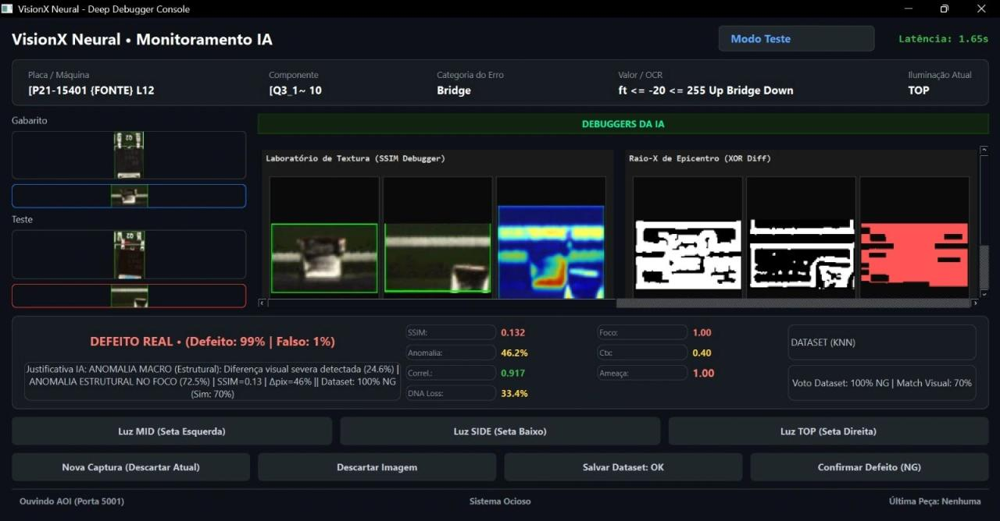
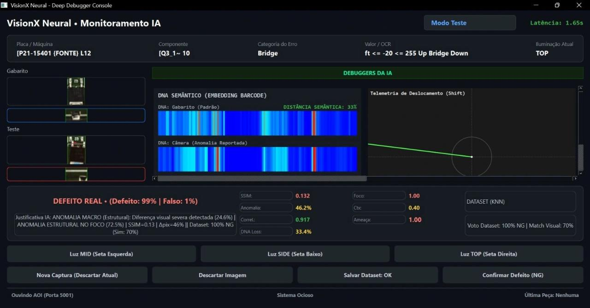

## Reconciliação automática do acervo e memória KNN (diagnóstico)

O comando abaixo investiga por código, no próprio computador, por que
a memória KNN não reconhece parte de `public/ok_archive` e
`public/ng_archive`. Nenhum envio manual de dataset é necessário.

```powershell
cd "C:\visionx-neural-main"
python -m src.services.startup_regression.archive_reconciler_cli
```

O programa verifica todos os JSONs em `public/dataset` e compara
os pares gabarito/teste, metadados, iluminação, assinaturas e
confirmação humana com cada PNG. Os relatórios
`reports/startup_regression/reconciliation_*.json` e
`reconciliation_*.txt` explicam a cobertura e mostram candidatos
de reconciliação. **Somente leitura: não migra, não treina,
não muda rótulos ou vereditos e não bloqueia o ODIN.**

Histórico do diagnóstico: CNN FALTANDO V2 = 201/202 e
MEMÓRIA KNN = 89/212 (122 lacunas e 1 OCR inválido).
O objetivo é encontrar as causas sem criar aprovações artificiais.
Detalhes: [`docs/ODIN_STARTUP_REGRESSION_GATE.md`](docs/ODIN_STARTUP_REGRESSION_GATE.md).

---

## 09/10/2026 — Correção: segunda verificação é MEMÓRIA KNN

O operador confirmou que **"CNN MEMÓRIA" significa a memória KNN
existente**, não outra rede CNN. A validação planejada é:

- **CNN FALTANDO V2:** FALTANDO, EMBORCADO, INVERTIDO, DESLOCADO;
  sem ADESIVO.
- **MEMÓRIA KNN exata verificada:** todas as categorias,
  inclusive MUITO ADESIVO. Exige exemplo humano exato no
  `public/dataset`, com mesma placa/peça/valor/iluminação e mesmo
  par visual. Ausência de registro = `SEM_COBERTURA`, não OK.
- Ambas precisam concordar com os rótulos visuais OK/NG.
  A CNN testa inferência de um modelo treinado; a KNN testa
  **recuperação do próprio histórico**, e não aprendizado cego.

O validador é **diagnóstico**, sem interferir no fluxo normal.
O bloqueio da inicialização ainda não foi ativado. Esta correção
**substitui** a seção anterior que mencionava segunda CNN ausente.

```powershell
cd "C:\visionx-neural-main"
python -m src.services.startup_regression.cnn_archive_validation_cli
```

---

## 09/10/2026 — Nova validação de inicialização por CNN (em integração)

O plano antigo de gate por múltiplos especialistas físicos foi substituído:
a validação obrigatória será feita exclusivamente por duas CNNs independentes.

- **CNN FALTANDO V2:** cobre FALTANDO, EMBORCADO, INVERTIDO e DESLOCADO;
  exclui MUITO ADESIVO.
- **CNN MEMÓRIA:** deve cobrir todas as categorias, inclusive MUITO ADESIVO.
- Ambas devem classificar corretamente **cada PNG elegível** em
  `ok_archive` e `ng_archive` usando seu checkpoint próprio. Revisão,
  classificação errada, ausência de modelo ou falha de cobertura reprova.
- A validação não treina, não consulta KNN/embeddings ou vizinhos e não
  roda o MoE antigo. Imagens antigas sem sufixo são SIDE; novas imagens
  SIDE/TOP/MID são avaliadas na luz correspondente.

**Disponível agora (diagnóstico não bloqueante):**

```powershell
cd "C:\visionx-neural-main"
python -m src.services.startup_regression.cnn_archive_validation_cli
```

O script escreve `reports/startup_regression/cnn_validation_*.json`
e `cnn_validation_*.txt`. A primeira CNN já está conectada;
a segunda **ainda não**: a branch central contém **KNN de memória
exata**, mas não apresenta uma classe/checkpoint identificável como
CNN MEMÓRIA. Ela será registrada como `MODEL_UNAVAILABLE`, sem criar
acerto artificial. O bloqueio em `main.py` somente será instalado
depois que o modelo real da CNN MEMÓRIA for localizado e validado,
para não interromper a operação por uma integração incompleta.

Documento mestre: [`docs/ODIN_STARTUP_REGRESSION_GATE.md`](docs/ODIN_STARTUP_REGRESSION_GATE.md).

---

## 09/10/2026 — Telemetria visual CNN FALTANDO v2 + KNN e debug XP

**Objetivo:** eliminar painéis vazios quando o ODIN decide com
__faltando_cnn_v2.py__ e/ou recuperação exata __KNOWN_KNN__.
**Escopo estritamente visual e de diagnóstico**: não muda motor, memória,
treinamento, consenso SIDE/TOP/MID, limiares produtivos ou comandos 0/1.

**Análise dos especialistas:**
- Widget CNN FALTANDO v2 na visão normal e nos três lanes SIDE, TOP e MID.
  Mostra categoria AOI original, rota, score NG não calibrado, complemento
  OK (não probabilidade de acerto), status de inferência, iluminação,
  verificação e digest abreviado do checkpoint.
- Widget KNN exato quando essa foi a rota efetiva, com rótulo humano;
  não declara que executou uma CNN que não participou.
- Nos eventos multilight, o motor atual de cada luz aparece sem os
  cards físicos antigos vazios. As telas de adesivo permanecem intactas.

**Decisão e confiança:**
- CNN: visualiza score NG **não calibrado**; não apresenta os percentuais
  como acurácia/certidão de que a peça está OK.
- Multilight: lista os votos SIDE/TOP/MID, o estado do consenso e a
  elegibilidade supervisionada, que continuam calculados pelo motor real.
- KNN: rótulo humano recuperado de PNGs exatos, sem percentuais
  fictícios de similaridade não calculada.

**Influência dos motores:**
- Mostra uma linha CNN por luz realmente inferida, com score NG original.
  Em fusão multilight, são **votos independentes**, não uma soma ponderada
  de porcentagens inventadas.
- Caso KNOWN_KNN registra que a decisão se originou do registro humano
  exato; se uma luz não usou CNN, não recebe score CNN.
- Motores físicos legados mantêm sua visualização já existente.

**Memória de anomalias KNN:**
- NEW_CNN = KNN pesquisada antes da CNN, **nenhum par exato humano**;
  não significa que similaridade da KNN seja 0%.
- KNOWN_KNN = histórico humano exato, identifica OK/NG e origem.
- MULTILIGHT_MIXED = identifica quais luzes usaram KNN e quais usaram CNN.
  Não desenhar barras 0% em ausência de medição.

**Debug copiável do XP:**
- Resumo visível da CNN, checkpoint SHA-256, status, score NG local,
  pontuações e rotas SIDE/TOP/MID, consenso, motivo e status de
  supervisão, além de bloco KNN (match exato e rótulo humano).
- Preserva a estrutura JSON e as análises SIDE/TOP/MID detalhadas;
  os antigos campos de ausência física/INVERTIDO sem cálculos deixam
  de poluir o bloco inicial quando só a CNN foi usada.
- A fusão mantém **os scores reais de cada luz** em
  __cnn_v2_light_diagnostics__; não reaproveita os valores apenas SIDE.

**Teste de regressão:** __tests/test_neural_telemetry_panels.py__, com
fixture INVERTIDO SIDE/TOP/MID de scores distintos baseado em captura
real de 09/10/2026. Os testes comprovam renderização e mapeamento
dos dados, **não avaliam sensibilidade da CNN a novos NG físicos**.


---

## 09/10/2026 — CNN FALTANDO v2 em FALTANDO / EMBORCADO / INVERTIDO / DESLOCADO

**Integração por categoria visual de ausência:** todas as quatro categorias
usam a CNN FALTANDO v2 para **novos pares** de gabarito/teste em Teste,
Sombra e Produção. **MUITO ADESIVO** e sinônimos continuam no especialista
dedicado. Memória KNN exata, humana e segregada por categoria original tem
prioridade, sem liberar variações aproximadas por semelhança.

**Modo Produção supervisionado:** CNN pode enviar **0=OK ou 1=NG** só com
consenso completo SIDE/TOP/MID da CNN, três scores conclusivos, mesmo
checkpoint SHA verificado e nenhum sinal de revisão. Aguarda 2000 ms antes
do envio; **Space** suspende/retoma o julgamento enquanto ainda não foi
transmitido. Divergência, uma única iluminação, mistura com KNN, falha de
modelo, score duvidoso e revisão exigem o operador. Teste e Sombra não
introduzem o envio automático. Sem mudança na CNN DESLOCADO cancelada.

**Atenção:** concordância histórica no dataset NÃO garante detecção de
NG inéditos. A mudança exige validação supervisionada na linha; o botão
Space não é um mecanismo de parada física depois que um comando foi enviado.
Ver [procedimento detalhado](docs/FALTANDO_CNN_DATASET_PREPARATION.md).

---

## 09/10/2026 — Auditoria visual transversal com CNN FALTANDO v2

A categoria da AOI é tratada como hipótese de classificação, não como
verdade física. Foi disponibilizado um **replay offline em todas as categorias**
com CNN FALTANDO v2, sem desenho, sem KNN e sem enviar 0/1 para o XP.
As proteções operacionais permanecem inalteradas até verificar os NG reais
fora da categoria FALTANDO. Execute
`python -m src.scripts.audit_faltando_cross_category` e consulte
[documentação FALTANDO](docs/FALTANDO_CNN_DATASET_PREPARATION.md).

---

## STATUS FINAL — CNN DESLOCADO: DESENVOLVIMENTO ABORTADO (08/10/2026)

**Decisão do operador:** suspender definitivamente esta linha de desenvolvimento
até uma eventual nova decisão expressa. **0 NG DESLOCADO reais**; não é possível
validar detecção de deslocamento físico, medir falsos OK de NG nem autorizar
substituição do motor operacional. **Não retomar treinamento, desenho de máscaras,
diagnósticos geométricos ou ativação de checkpoint como continuação deste plano.**

**Placar histórico (métricas de tarefas diferentes):** CNN v1 **0/6 OK de
desenvolvimento**; CNN v2 **31/34 OK conhecidos** no replay sem KNN, com
**3 falsos NG** e **0 NG reais avaliados**; geometria v1 **7/34 com métricas
disponíveis** (não classificação); geometria v1.1 **0/34 registros aceitos**.
As máscaras v3/v3.1 e o plano one-class **não produziram CNN v3 validada**.

**[Retrospectiva técnica, metodologia, falhas e lições](docs/DESLOCADO_CNN_POSTMORTEM_2026-10-08.md)**

**Os comandos e as propostas das seções antigas abaixo são histórico, não
instruções para continuar o projeto.** O ODIN operacional, a CNN FALTANDO, as
imagens do acervo e os checkpoints históricos não foram alterados por esta decisão.

---

## Diagnóstico DESLOCADO v1.1 — disponível para execução

Foi criada uma alternativa ao método de registro visual global da v1:
**ORB + AKAZE / RANSAC**, com bloqueios geométricos, comparação automática
com a v1 e SEM máscaras manuais, KNN, CNN treinada ou alterações de Produção.
A utilidade real será avaliada nos 34 pares OK da fábrica.

`python -m src.scripts.diagnose_deslocado_ok_geometry_v11`

Consulte [o protocolo DESLOCADO](docs/DESLOCADO_CNN_DATASET_AND_TRAINING.md).

---

## DESLOCADO — diagnóstico automático sem desenho (etapa disponível)

`python -m src.scripts.diagnose_deslocado_ok_geometry` analisa todo o
acervo DESLOCADO OK, conferindo hashes e cobertura do inventário e emitindo
métricas geométricas exploratórias, **sem máscaras manuais, KNN, CNN, treino
ou alteração da Produção**. Isso não classifica defeitos NG. Consulte
[os procedimentos](docs/DESLOCADO_CNN_DATASET_AND_TRAINING.md).

---

## CNN DESLOCADO — plano novo sem máscaras manuais

A revisão de máscaras v3/v3.1 por desenho foi **descontinuada como requisito**.
O próximo experimento usará pares **OK** e aprendizado de normalidade,
com invariância à inscrição e iluminação, sem KNN. Não há NG DESLOCADO
reais para certificar a rejeição de defeitos. Nenhum modelo ou motor operacional
foi alterado nesta mudança de diretriz.

Consulte [o protocolo de experimentos](docs/DESLOCADO_CNN_DATASET_AND_TRAINING.md).

---

## CNN DESLOCADO v3.1 — máscaras reais (offline)

O catálogo v3 anterior registra apenas **retângulos**. O refinamento v3.1
produz propostas de máscaras binárias com revisão humana obrigatória,
editor de pixels e exclusão explícita de recortes cortados. Nada é treinado
ou ligado ao motor operacional. Execute o fluxo no
[guia DESLOCADO](docs/DESLOCADO_CNN_DATASET_AND_TRAINING.md).

---

# VisionX Neural

## CNN DESLOCADO v3 — verificação da máscara do componente

As três imagens SIDE que a CNN v2 confundiu com NG
mostram marcações internas diferentes, embora os corpos
dos componentes pareçam alinhados. O simulador v2,
além disso, moveu o caractere `104`, não o corpo inteiro.

Implementei um **gate de revisão do corpo físico** que
gera `body_masks_review.json` e previsualizações de
cada par gabarito/teste. Todas as caixas começam
**sem aprovação**, e precisam ser verificadas antes
do próximo treino:

```powershell
python -m src.scripts.prepare_deslocado_body_masks_v3
```

Existe revisão gráfica opcional:
`python -m src.scripts.review_deslocado_body_masks_v3 --review "CAMINHO\\body_masks_review.json"`
(`a` aprovar, `e` editar, `s` pular, `q` sair).
Valide as caixas confirmadas com
`python -m src.scripts.prepare_deslocado_body_masks_v3 --review "CAMINHO\\body_masks_review.json"`.
O arquivo de saída validado gera previews verdes.

Nenhuma CNN v3 foi treinada e o motor DESLOCADO
permanece físico. Veja
[documentação DESLOCADO](docs/DESLOCADO_CNN_DATASET_AND_TRAINING.md).

---


## CNN DESLOCADO v2 — replay completo: 31/34 OK

O replay real de `ok_archive` processou 34 imagens e
24 eventos da categoria DESLOCADO, sem consulta KNN:
**31/34 OK reconhecidos**, **3 falsos NG**, todos
na iluminação SIDE legada; TOP/MID 5/5 cada.
O modelo continua candidato, pois não há NG real
e a v2 sintética deslocou parte da inscrição `104`,
não o componente inteiro.

A rotina `python -m src.scripts.diagnose_deslocado_ok_failures`
gera painéis gabarito/teste/diferença para as três falhas,
a serem examinados antes de retreinar.
**Não trocar o motor operacional pelo modelo OK-only.**
Consulte [documentação DESLOCADO](docs/DESLOCADO_CNN_DATASET_AND_TRAINING.md).

---


## Replay completo dos OK DESLOCADO com CNN v2

Use `python -m src.scripts.replay_deslocado_ok_v2` para
avaliar **todos os arquivos DESLOCADO de `ok_archive`**,
incluindo SIDE legado e SIDE/TOP/MID, com o checkpoint v2
existente. O script verifica cobertura integral, hash dos
arquivos e relata todos os falsos NG por imagem e evento
em `reports/deslocado_neural/replays/`.

Os previews fornecidos mostraram que o proxy v2 deslocou
somente parte da inscrição `104`, não o resistor inteiro.
Assim, **acertar 100% dos OK não basta para substituir
o motor DESLOCADO**: sem NG reais, a rede que responde
sempre OK também passaria. A integração física permanece
inalterada. Veja
[documentação DESLOCADO](docs/DESLOCADO_CNN_DATASET_AND_TRAINING.md).

---

## CNN DESLOCADO v2 — correção do treinamento experimental

A CNN DESLOCADO v1 concluiu 15 épocas e acertou os proxies
artificiais de desenvolvimento, mas errou **todos os seis OK reais**
reservados (**0/6**). Por isso, foi reprovada.

A nova v2 utiliza uma hipótese de máscara de componente para deslocar
a peça em vez de mover um patch inteiro; também gera OK com a mesma
reconstrução, reduzindo pistas de artefato. Mantém as três luzes,
holdout agrupado por placa/componente e diagnóstico por imagem.
O requisito para avançar na avaliação de desenvolvimento é
**zero falsos NG entre os OK reservados**. Como ainda não há NG
reais DESLOCADO, nenhum checkpoint é autorizado à Produção.

Para testar no PC da fábrica: `python -m src.scripts.train_deslocado_cnn_v2 --epochs 25`.
Consultar [documentação DESLOCADO](docs/DESLOCADO_CNN_DATASET_AND_TRAINING.md).

---

## CNN DESLOCADO — nova especialidade em preparação

A categoria **DESLOCADO** passa a ter pipeline próprio de dados, modelo
e aprendizado incremental, espelhando a estrutura da CNN FALTANDO.
**Ainda não há NG DESLOCADO real**: o treinamento inicial utiliza OK
e alterações locais sintéticas apenas como proxy experimental.

Execute `python -m src.services.deslocado_neural_dataset` para
extrair o acervo e `python -m src.scripts.train_deslocado_cnn --epochs 15`
para inicializar o checkpoint. Novos rótulos humanos de
DESLOCADO, em Teste/Produção/Sombra, são coletados pela fila
incremental com pesos **apenas candidatos**.

A CNN DESLOCADO **não está ativa na decisão**: os motores físicos
permanecem, pois não há NG reais independentes para avaliar
sua capacidade de detectar deslocamento. Veja
[dataset e treinamento DESLOCADO](docs/DESLOCADO_CNN_DATASET_AND_TRAINING.md).

---


**VisionX Neural** é um sistema experimental de visão computacional e inteligência artificial para apoio à inspeção visual de componentes eletrônicos em ambiente industrial.

O objetivo do projeto é atuar como um módulo inteligente de análise visual, comparando imagens de referência com imagens capturadas durante o processo, identificando possíveis anomalias, registrando evidências e apoiando a tomada de decisão entre **OK** e **NG**.

---

## Identidade visual

A interface operacional é apresentada ao usuário como **ODIN - Observador Digital Inteligente**. O nome técnico do repositório, schemas e identificadores internos `visionx` permanecem preservados por compatibilidade.

---

## Visão geral

O sistema foi desenvolvido em **Python** com interface em **PyQt6**, combinando técnicas de visão computacional clássica, análise de similaridade visual, extração de características e mecanismos de aprendizado incremental.

A aplicação foi pensada para cenários onde uma máquina, câmera ou estação de inspeção precisa de um apoio adicional para analisar regiões críticas da peça, reduzindo a dependência de validações totalmente manuais e criando histórico visual para melhoria contínua.

---

## Demonstração visual

### Deep Debugger — SSIM, anomalia e XOR Diff



### DNA Semântico e telemetria de deslocamento



---

## Principais recursos

- Interface desktop para monitoramento técnico em tempo real.
- Painéis inferiores responsivos a partir de **DECISÃO E CONFIANÇA**: em notebooks, cards e ações são empilhados/refluídos para preservar leitura e toque; em monitores grandes, decisão, memória, iluminação e ações ocupam múltiplas colunas. Arquivos OK/NG, diagnóstico da captura e os três indicadores SVG da barra inferior também acompanham o breakpoint.
- **Imagens da inspeção responsivas**: gabarito, teste e respectivos epicentros reescalam o pixmap sempre que o próprio viewport muda de tamanho. A divisória entre **IMAGENS DA INSPEÇÃO** e **ANÁLISE DOS ESPECIALISTAS** deixou de ser ajustável pelo operador; o layout reserva automaticamente uma área estável e responsiva para manter as imagens inteiras, sem o efeito de “zoom” causado pelo arraste manual.
- **Análise dos especialistas com navegação horizontal**: o painel normal mantém uma barra horizontal sempre visível; durante qualquer ciclo multilight, SIDE/TOP/MID usam uma barra horizontal mestre única que sincroniza os especialistas das três iluminações. O Modo Produção também percorre essa barra automaticamente durante a apresentação.
- Feedback visual temporário das teclas operacionais: `0 = OK`, `1 = NG` e setas de iluminação `← TOP / ↓ SIDE / → MID`, sem bloquear a interface.
- Card flutuante de iluminação atual, exibindo `TOP`, `SIDE` ou `MID` somente quando a análise termina; ele aparece junto com o veredito final e desaparece sincronizado com os demais feedbacks ao encerrar o julgamento.
- **Inspeção multilight geral na AOI**: todo ciclo recebido do Windows XP com uma categoria AOI válida trata `SIDE`, `TOP` e `MID` como três observações da **mesma peça e do mesmo event_id**. A primeira SIDE inicia automaticamente `PRESS_LEFT → TOP → PRESS_RIGHT → MID → PRESS_DOWN → SIDE`; cada iluminação percorre o mesmo pipeline técnico e somente depois das três análises existe um julgamento final. `MUITO ADESIVO` preserva a fusão física especializada de `src/core/adhesive_multilight_fusion.py` e o perfil MID `mid_bright_resin_v1`; as demais categorias usam `src/core/multilight_fusion.py`, que confirma evidência forte/corroborada e envia divergências isoladas para revisão. **Copiar debug** inclui SIDE/TOP/MID e a fusão final; **Copiar imagem** gera uma única evidência composta SIDE/TOP/MID lado a lado. A captura local MSS permanece monoimagem, pois não controla a sequência de iluminação da AOI.
- Overlay de estado da IA no canto superior direito, exibindo `FALHA FALSA`, `DEFEITO REAL` ou `REVISÃO OBRIGATÓRIA`, sem porcentagens ou métricas. `FALHA FALSA` usa verde; `DEFEITO REAL` e `REVISÃO OBRIGATÓRIA` usam vermelho. Ele permanece fixo durante a análise e, quando o operador julga com `0/1`, desaparece sincronizado com o fade-out do feedback de tecla. O fundo geral permanece neutro em todos os estados.
- **Modo Produção autônomo v1 validado operacionalmente**: o contrato de julgamento, pausa por `Space`, contador, precisão, média de tempo, intervenção e retomada automática foi validado na AOI real. As métricas agora formam uma **sessão diária persistente**: `OK AUTO`, `NG AUTO`, `MANUAL`, `ANÁLISES`, precisão e acumuladores da média de tempo são salvos fora do repositório e restaurados durante todo o mesmo dia, sobrevivendo a fechamento/reabertura do ODIN, troca de modo e atualização do código. A sessão só começa zerada quando a data local muda. O refinamento visual atual torna a apresentação mais lenta e também percorre horizontalmente **ANÁLISE DOS ESPECIALISTAS**. `FALHA FALSA` continua enviando `0 = OK`; `DEFEITO REAL/NG` e `REVISÃO OBRIGATÓRIA` continuam aguardando o operador. O Modo Teste permanece inalterado.
- **OCR contextual da interface AOI**: `Board`, `Parts` e `Value` recebem pós-processamento específico por campo. Artefatos de borda como `[` são removidos; operandos de expressões comparativas são normalizados somente em contexto numérico, incluindo confusões como `I/i/l → 1`, `O/o → 0` e `$ / S → 5`. `Parts` também normaliza apenas o sufixo numérico (`u2~s → U2~5`) e, quando ainda não forma uma referência válida, faz uma segunda leitura dirigida da célula para casos como `RI~5 → R3~5`, sem hardcode do componente.
- Comparação entre imagem de **gabarito** e imagem de **teste**.
- Análise visual com métricas de similaridade e diferença estrutural.
- Painel de depuração para investigação da decisão da IA, com **Copiar debug** e **Copiar imagem** disponíveis tanto para frames recebidos do Windows XP quanto para capturas locais MSS.
- Classificação assistida entre imagem **OK** e possível defeito **NG**.
- Proteção de ausência física dual-scale: o epicentro local é combinado, quando necessário, com uma ROI contextual maior para detectar componentes ausentes que ainda parecem semelhantes em um patch pequeno; `FALTANDO` e a guarda transversal de `EMBORCADO/DESLOCADO/INVERTIDO` terminam na mesma fusão central, mantendo categoria e memória isoladas.
- **FALTANDO com footprint preservado — correção implementada, aguardando validação real**: o falso negativo de 07/10/2026 mostrou componente fisicamente ausente, `missing_is_defect=True` e `physical_score=0.88`, mas a silhueta/pads preservaram geometria e o KNN `OK ≈ 90,4%` venceu. O especialista agora possui uma rota dedicada que só promove `missing_hard_absence` quando `geometry_only` está contradito por correlação coarse praticamente nula e existe concordância entre ROI local, contexto dual-scale e motores estrutural/semântico. Nessa rota, massa global invariável não devolve autoridade ao KNN; a testemunha OK quase exata de 99,5% continua preservada como proteção.
- **Active Learning multilight por iluminação**: após um único julgamento humano da peça, o dataset pode persistir três memórias relacionadas ao mesmo `event_id`: `SIDE`, `TOP` e `MID`. As três reutilizam o mesmo OCR (`Board/Parts/Category/Value`) e o mesmo rótulo humano OK/NG, mas preservam a análise local e a identidade da iluminação. A consulta KNN é isolada por **categoria + iluminação**; memórias antigas sem `lighting_mode` são tratadas como `SIDE`. Cada memória mantém três escalas visuais — epicentro, contexto maior do componente e quadro completo da área de inspeção — para não perder defeitos que estejam fora do quadrado menor. O frame bruto da AOI também pode ser preservado para auditoria, sem virar entrada direta do KNN. A deduplicação do dataset considera `Board + Parts + categoria + iluminação + conteúdo visual exato`: um SIDE legado idêntico não é salvo novamente, enquanto TOP/MID continuam independentes. NG repetido preserva um JSON de memória por observação, mas não duplica a imagem pesada; OK redundante mantém a política de protótipos existente.
- Arquivo visual NG: inicia **ativado por padrão** e salva em `public/ng_archive/` a evidência completa do evento XP. Para qualquer ciclo multilight completo da AOI, o mesmo julgamento arquiva separadamente as três imagens completas `SIDE/TOP/MID` da mesma peça. A fila faz deduplicação persistente por conteúdo visual: se uma imagem pixel a pixel idêntica já existir no arquivo, ela não é salva novamente, mesmo em outro evento ou após reiniciar o ODIN. O `event_id` continua impedindo eco do mesmo julgamento.
- Arquivo visual OK: inicia **ativado por padrão**, fica logo abaixo do controle NG e salva em `public/ok_archive/` cada julgamento humano OK, tanto para XP quanto MSS. Para qualquer ciclo multilight completo da AOI, salva separadamente `SIDE/TOP/MID` da mesma peça. A mesma deduplicação persistente por conteúdo visual é usada: imagens idênticas não são repetidas; imagens diferentes continuam sendo preservadas.
- Suporte a fluxo de **active learning**, permitindo melhorar a base de exemplos com validação humana.
- Organização modular em camadas de configuração, núcleo, serviços, interface e utilitários.

---

## Técnicas utilizadas

O projeto combina diferentes abordagens para aumentar a confiabilidade da análise visual:

| Técnica | Uso no sistema |
|---|---|
| **OpenCV** | Tratamento de imagem, recortes, comparação visual e operações de visão computacional. |
| **SSIM** | Medição de similaridade estrutural entre referência e imagem analisada. |
| **XOR Diff** | Visualização das regiões que apresentam diferença relevante. |
| **PyTorch** | Base para módulos de rede neural e análise comparativa. |
| **KNN / Dataset local** | Apoio à decisão com base em amostras salvas. |
| **PyQt6** | Construção da interface desktop e painéis de depuração. |
| **mss** | Captura rápida de tela para integração com ambiente de inspeção. |

---

## Aprendizado incremental das CNNs (Teste / Produção / Sombra)

Uma decisão humana `OK` ou `NG` para **CASO NOVO • CNN FALTANDO v2**
é salva normalmente e dispara treino local em segundo plano
imediatamente, inclusive se IA e operador concordarem.
Os pares gabarito/teste SIDE/TOP/MID são agrupados em um evento.
O treinamento não congela a estação ou comandos XP.

O sistema usa replay dos casos antigos para evitar esquecimento,
salva um checkpoint candidato e só troca o modelo ativo se
**todos os exemplos históricos e confirmados** continuarem
corretos. Se falhar, preserva os pesos atuais.
Nunca aprende rótulos `production_auto`; não habilita auto-OK
ainda, pois os NG inéditos TOP/MID seguem sem validação
independente. Os arquivos da fila, logs e pesos ficam locais em
`reports/neural_online/`, ignorados pelo Git.
A estrutura `SPECIALIST_TRAINERS` permite criar treinadores
próprios para futuras CNNs. [Detalhes](docs/FALTANDO_CNN_DATASET_PREPARATION.md).

---

## Roteamento inteligente da inspeção — memória KNN ou especialistas

Antes de iniciar a análise de um componente, o ODIN verifica se o
**par gabarito/teste** já consta em um **registro humano validado da
memória KNN**, com a mesma placa, componente, categoria, iluminação
e valor da AOI. Quando o par é **exatamente igual**, recupera seu
rótulo OK/NG da memória, dispensando motores/CNN. Casos novos não
recebem voto KNN: `FALTANDO` segue para CNN v2 e outras categorias
seguem para seus motores. Um registro contraditório ou entrada
inválida exige revisão. Similaridade aproximada não é suficiente.

O painel mostra **CASO CONHECIDO • MEMÓRIA KNN** ou
**CASO NOVO • CNN/MOTORES**, com tooltip explicativo e, em
multilight, a rota de cada luz. A CNN FALTANDO experimental
continua sem AUTO-OK em Produção; um evento com pelo menos
uma luz CNN nova também requer confirmação do operador.

Este critério é conservador: registros sem os dois PNGs ou
sem rótulo comprovadamente humano **não** são reconhecidos
automaticamente. Veja
[documentação do roteador](docs/FALTANDO_CNN_DATASET_PREPARATION.md).

---

## CNN FALTANDO v2 na análise normal do ODIN

O replay real da CNN v2 obteve **117/117 imagens (67/67 eventos) corretos**
nos arquivos `ok_archive/ng_archive` sem KNN. A integração em
`main.py` encaminha apenas `FALTANDO` diretamente para a
**CNN v2 carregada do checkpoint local fixado por SHA-256**;
as outras categorias mantêm o MoE anterior. SIDE/TOP/MID e
capturas SIDE legadas são suportados. Sem checkpoint válido,
a análise exige `REVISÃO OBRIGATÓRIA`. A produção **não
envia OK automático** de resultado experimental CNN: o
operador confirma 0/1, mesmo quando a rede diz FALHA FALSA.
O replay de imagens usadas no treino **não é teste cego**.
Mais detalhes em [documentação FALTANDO](docs/FALTANDO_CNN_DATASET_PREPARATION.md).

---

## CNN FALTANDO v2 — replay de todos os arquivos OK/NG

O comando `python -m src.scripts.replay_faltando_cnn_v2` executa
inferência offline (sem KNN) em todos os PNGs FALTANDO de
`public/ok_archive/` e `public/ng_archive/`, conferindo que não
há fotos omitidas, e produz resultados por iluminação, imagem e
evento em `reports/faltando_neural/replays/`.
O modelo é o **checkpoint v2 já treinado**, não reentreinado.
Aprovar 100% do acervo conhecido é **teste de regressão histórica**,
não prova de generalização, pois há imagens vistas no treino.
O modo Produção e a lógica de julgamento não foram alterados.
Veja [documentação FALTANDO](docs/FALTANDO_CNN_DATASET_PREPARATION.md).

---

## Resultado real da CNN FALTANDO v2 (08/10/2026)

Na validação de **desenvolvimento** da v2, após 25 épocas na CPU,
a rede acertou **13/13 eventos (11 OK e 2 NG)**, recuperando os dois
NG SIDE que a v1 não detectava. O modelo original selecionou
a época 18 como checkpoint; o código foi corrigido para escolher
a menor perda efetiva nas próximas execuções.
**Acurácia de 100% nesse conjunto reutilizado não constitui
teste cego nem aprovação para produção**: ainda faltam
NG TOP/MID e novos defeitos independentes.
Ver [histórico e limitações](docs/FALTANDO_CNN_DATASET_PREPARATION.md).

---

## CNN FALTANDO v2 — treinamento experimental e diagnóstico real v1

O primeiro treinamento da v1 concluiu 25 épocas sobre 117 frames/67 eventos,
porém na validação de desenvolvimento classificou **13/13 eventos como OK**
(11 OK corretos, **2 NG liberados como OK**, recall NG 0%).
Não será integrado em Produção.

A nova CNN v2 compara gabarito/teste e diferença visual diretamente,
com imagem integral e região central ampliada. Treina com sampler balanceado
e gera relatório por evento/luz e curva de treinamento. A v1 permanece
intacta. Execute `python -m src.scripts.train_faltando_cnn_v2 --epochs 25 --device cpu`
após `git pull origin central`; veja
[documentação CNN FALTANDO](docs/FALTANDO_CNN_DATASET_PREPARATION.md).
Pesos continuam experimentais e não alteram o ODIN operacional.

---

## Treinamento experimental da CNN FALTANDO

Após extrair os pares com `python -m src.services.faltando_neural_dataset`,
execute `python -m src.scripts.train_faltando_cnn --epochs 25 --device cpu`.
A rede compara gabarito/teste, usa SIDE histórico e grupos OK SIDE/TOP/MID
consistentes por nome+OCR (sem inventar event_id), e salva pesos candidatos
e métricas em `reports/faltando_neural/models/`. Por solicitação do operador,
o treinamento usa os rótulos das pastas sem exigir o painel de revisão manual.
O checkpoint é **experimental e não está habilitado em Produção**: não há
NG TOP/MID, e desempenho em holdout com poucos NG não certifica segurança.
Detalhes em [Treinamento CNN FALTANDO](docs/FALTANDO_CNN_DATASET_PREPARATION.md).

---

## Qualificação visual offline CNN FALTANDO

Após preparar o acervo, execute `python -m src.ui.faltando_neural_review`
para revisar os pares gabarito/teste, confirmar OK/NG/recorte inválido e
validar manualmente trincas SIDE/TOP/MID. As decisões são salvas
automaticamente em `qualification.json` no staging local.
Sugestões dHash de proximidade visual **não** alteram classificações.
Não treina CNN nem afeta a operação. Consulte
[Qualificação visual FALTANDO](docs/FALTANDO_CNN_DATASET_PREPARATION.md).

---

## Preparação offline do dataset para CNN FALTANDO

Ferramenta disponível: `python -m src.services.faltando_neural_dataset`.
Reusa a extração gabarito/teste da AOI e produz pares derivados e manifestos
locais em `reports/faltando_neural/`. Não treina modelo, altera rótulos
ou interfere na Produção. Antes do treino, todos os exemplos exigem revisão
humana, incluindo a identidade dos eventos SIDE/TOP/MID. Consulte
[Preparação CNN FALTANDO](docs/FALTANDO_CNN_DATASET_PREPARATION.md).

---
## Planejado — validação obrigatória do acervo OK/NG na inicialização

**Ainda não implementado.** A evolução planejada é reanalisar **todos** os
screenshots de `public/ok_archive/` e `public/ng_archive/` antes de abrir
o ODIN operacional. Evidências antigas sem sufixo serão tratadas como
**SIDE monoimagem**, com comparação estrita ao rótulo confirmado; novos
eventos SIDE/TOP/MID serão avaliados pela **fusão final única** da peça,
não pela exigência de que as três luzes coincidam individualmente.

O gate deverá bloquear a operação em caso de regressão, revisão,
imagem inválida ou evento incompleto, apresentar relatório de diagnóstico
e nunca comandar a AOI ou modificar o dataset durante o replay. Eventos
multilight novos exigirão manifesto com `event_id`, OCR compartilhado,
rótulo e vínculo confiável das três imagens. A implementação começará
por inventário/qualificação do acervo real e será executada em etapas.

**Etapa 2 disponível — replay SIDE histórico SEM MEMÓRIA (diagnóstico).**
Com os módulos do repositório atualizados, executar:

```powershell
cd "C:\visionx-neural-main"
python -m src.services.startup_regression.side_replay
```

O comando reprocessa os **119 screenshots SIDE históricos** com o mesmo
extrator de barras/OCR e motores visuais do ODIN, **sem construir ou consultar
o KNN, sem acessar o dataset de memória e sem salvar imagens**. Os resultados
vão para `reports/startup_regression/side_replay_<data>.json` e
`side_replay_<data>.txt`. Qualquer imagem não classificável por OCR ou falha
de um especialista aparece como `INVÁLIDO` e não é aprovada.
Os 90 PNGs SIDE/TOP/MID explícitos ficam para a Etapa 3, que também deverá
ignorar a memória. Este modo NÃO altera a decisão de produção nem bloqueia
a abertura atual do ODIN.

**Telemetria física do replay SIDE (Etapa 2 em diagnóstico):** a primeira
execução do acervo histórico encontrou 17/119 casos aprovados (17 NG),
101 falsos NG entre casos OK e 1 OCR inválido. O replay agora produz
`cases[].telemetry` no JSON com trilha por especialista
(`raw_score`, `threshold`, `effective_score`, `final_influence`,
motor dominante e regra) e `geometry` (gabarito/teste completos, caixa
global, epicentro, anomalias e caixas dos motores). O TXT apresenta
evidências de **todos** os OK e NG para comparação. A telemetria é coletada
após a inferência, não altera vereditos, e a consulta KNN continua proibida.
Executar novamente o comando acima e enviar os dois relatórios atualizados
para investigação. **Nenhum bloqueio de startup foi ativado.**

**Etapa 1 disponível — inventário de leitura (não é gate de decisão).**
Com o código atualizado, executar no PowerShell:

```powershell
cd "C:\visionx-neural-main"
python -m src.services.startup_regression
```

Serão criados `reports/startup_regression/inventory_<data>.json` e
`inventory_<data>.txt` com quantidades OK/NG, iluminação legada e explícita,
dimensões, problemas de integridade, duplicatas e pendências de associação
multilight. O script não modifica imagens ou dataset; não executa OCR nem
classificação OK/NG. O gate de bloqueio continuará desativado até as etapas
seguintes.

**Especificação e checklist de implementação:**
[`docs/ODIN_STARTUP_REGRESSION_GATE.md`](docs/ODIN_STARTUP_REGRESSION_GATE.md).

---

## Arquitetura planejada

O projeto foi organizado em quatro pilares principais:

1. **Extrator Visual**  
   Monitora a tela ou fonte de imagem, captura regiões de interesse e prepara os dados para análise.

2. **Cérebro Comparativo**  
   Compara gabarito e teste usando visão computacional, métricas visuais e modelos de IA.

3. **Display HUD / Painel de Controle**  
   Exibe o diagnóstico, métricas de confiança, visualizações intermediárias e ações disponíveis.

4. **Active Learning**  
   Permite salvar exemplos aprovados ou rejeitados, alimentando um dataset local para melhoria contínua.

---

## Estrutura do projeto

```txt
visionx-neural/
├── public/
│   ├── debug_crop/
│   ├── debug_ocr/
│   ├── ng_archive/
│   └── ok_archive/
├── src/
│   ├── config/
│   ├── core/
│   ├── scripts/
│   ├── services/
│   ├── ui/
│   └── utils/
├── main.py
├── estrutura_projeto.md
└── .gitignore
```

### Descrição das principais pastas

| Pasta / arquivo | Função |
|---|---|
| `main.py` | Ponto de entrada da aplicação. Inicializa a interface principal. |
| `src/config/` | Centralização de configurações, caminhos e constantes. |
| `src/core/` | Núcleo de processamento e regras principais da análise visual. |
| `src/services/` | Serviços auxiliares de captura, processamento ou comunicação. |
| `src/ui/` | Componentes de interface gráfica. |
| `src/utils/` | Funções utilitárias usadas pelo sistema. |
| `public/debug_crop/` | Saídas e recortes usados para depuração visual. |
| `public/debug_ocr/` | Arquivos de apoio e depuração relacionados a OCR. |
| `public/ng_archive/` | Evidências NG do Windows XP salvas somente quando o toggle "Salvar imagens NG" está ativado. Usa exatamente o mesmo frame completo de "Copiar imagem XP"; não alimenta o KNN. |
| `public/ok_archive/` | Evidências OK confirmadas pelo operador, vindas de XP ou MSS, salvas somente quando "Salvar imagens OK" está ativado. Usa a mesma evidência completa de "Copiar imagem"; não alimenta o KNN. |

---

## Instalação

Clone o repositório:

```bash
git clone https://github.com/carlosdaniel003/visionx-neural.git
cd visionx-neural
```

Crie um ambiente virtual:

```bash
python -m venv .venv
```

Ative o ambiente virtual:

```bash
# Windows
.venv\Scripts\activate

# Linux/macOS
source .venv/bin/activate
```

Instale as dependências principais:

```bash
pip install PyQt6 opencv-python torch torchvision mss numpy pillow scikit-image scikit-learn
```

> Observação: caso o projeto passe a ter um `requirements.txt`, prefira instalar com `pip install -r requirements.txt` para manter as versões padronizadas.

---

## Como executar

Com o ambiente virtual ativo, execute:

```bash
python main.py
```

A aplicação inicia o painel principal do VisionX Neural.

---

## Fluxo básico de uso

1. Carregar ou capturar a imagem de referência da peça.
2. Capturar a imagem de teste.
3. Comparar as regiões críticas entre gabarito e teste.
4. Avaliar métricas como similaridade, anomalia, correlação e perda visual.
5. Exibir o diagnóstico sugerido pela IA.
6. Confirmar a classificação como **OK** ou **NG**.
7. Salvar a amostra no dataset para evolução da base de conhecimento.

---

## Objetivo industrial

O VisionX Neural foi pensado para aplicações de inspeção visual em processos produtivos, especialmente onde pequenos componentes eletrônicos precisam ser avaliados com consistência.

A proposta é criar uma camada adicional de inteligência sobre o processo, permitindo:

- mais rastreabilidade visual;
- menor dependência de análise subjetiva;
- apoio ao operador ou técnico responsável;
- formação de histórico de defeitos;
- evolução contínua da base de exemplos;
- maior velocidade na validação de possíveis falhas.

---

## Status do projeto

Projeto em desenvolvimento e evolução contínua.

O repositório concentra a base do sistema VisionX Neural, incluindo interface, organização modular, estrutura de depuração e fundamentos para análise visual com IA.

---

## Autor

Desenvolvido por **Carlos Daniel**.

- GitHub: [carlosdaniel003](https://github.com/carlosdaniel003)
- Projeto: [VisionX Neural](https://github.com/carlosdaniel003/visionx-neural)
